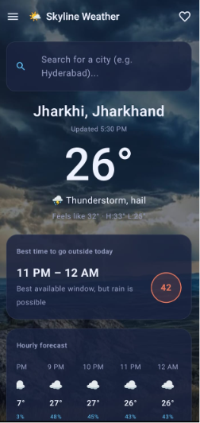
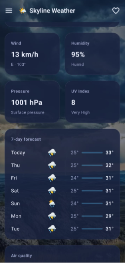
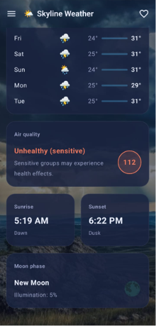

# 🌤️ Skyline Weather

A modern Android weather application built with **Kotlin** and **Jetpack Compose**, designed to provide useful weather information through a clean and simple interface.

## ✨ Features

- 🔎 Search weather by city
- 🌡️ Current temperature and weather conditions
- 🕐 Hourly weather forecast
- 📅 7-day forecast
- 💨 Wind information
- 💧 Humidity
- 🧭 Atmospheric pressure
- ☀️ UV Index
- 🌤️ Best time to go outside
- ❤️ Favorite locations
- 🌧️ Dynamic weather visuals

## 🛠️ Tech Stack

- **Kotlin**
- **Jetpack Compose**
- **Android SDK**
- **MVVM**
- **ViewModel**
- **Retrofit**
- **REST API**
- **Material 3**
- **Gradle**

## 📱 App Preview

 <p align="center">
  
  
  
</p>

### 🎥 Demo Video

[▶️ Watch Skyline Weather Demo](./Skyline-Weather-Demo.mp4)

## 🏗️ Project Structure

```text
app/
└── src/
    └── main/
        ├── java/
        │   └── com/example/myapplication/
        │       ├── MainActivity.kt
        │       ├── WeatherViewModel.kt
        │       └── data/
        │           ├── WeatherApi.kt
        │           └── WeatherModels.kt
        └── res/
